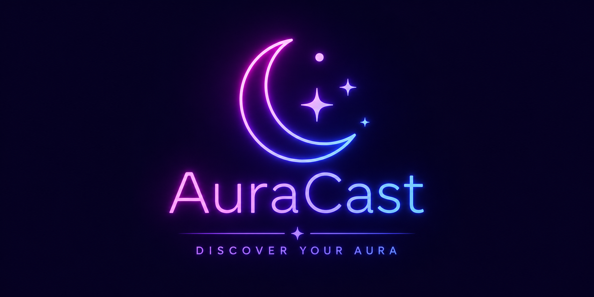
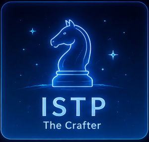

```md
<div align="center">

# ✨🌈 Auracast 🌈✨

### 감성과 분위기로 알아보는 MBTI 테스트 사이트 🔮



<br/>

💫 당신만의 오라(Aura)를 분석해보세요 💫

🎭 16가지 MBTI 결과 제공  
🎨 감성적인 디자인과 분위기  
🪄 각 성격별 전용 결과 이미지  
🌌 몽환적인 컬러와 인터랙션 효과  

<br/>

🔗 GitHub Pages 바로가기  
👉 https://jhw0407.github.io/JHW0407_vibe/

<br/><br/>

---

## 🌠 Preview

| 시작 화면 | 결과 화면 |
|---|---|
| ✨ 감성적인 메인 화면 | 🧠 MBTI 결과 분석 |
| 🌈 그라데이션 포인트 | 🎨 결과별 전용 이미지 |

---

## 🎀 Features

✨ 16가지 MBTI 결과 제공  
✨ 질문 선택에 따라 결과 변화  
✨ 결과별 전용 이미지 출력  
✨ 감성적인 UI 디자인  
✨ 모바일 & PC 환경 지원  
✨ GitHub Pages 배포 완료  

---

## 🪄 About

Auracast는  
사용자의 분위기와 성향을 감성적으로 표현하는  
MBTI 테스트 웹사이트입니다 🌌

단순한 테스트가 아니라  
“오라를 분석한다”는 컨셉으로 제작되었습니다 ✨

또한 바이브코딩 방식으로  
아이디어를 빠르게 구현하며 제작했습니다 🎧

---

## 🌈 MBTI Types

| Analyst 🧠 | Diplomat 🌸 | Sentinel 🛡️ | Explorer 🎮 |
|---|---|---|---|
| INTJ | INFJ | ISTJ | ISTP |
| INTP | INFP | ISFJ | ISFP |
| ENTJ | ENFJ | ESTJ | ESTP |
| ENTP | ENFP | ESFJ | ESFP |

---

## 💻 Tech Stack

🎨 React  
⚡ Vite  
🌐 GitHub Pages  

---

## 📸 Screenshots

### 🌌 Intro


<br/>

### 🎭 Example Result



---

## ⭐ Special Point

Auracast는  
단순한 MBTI 테스트가 아니라  
사용자의 분위기와 감성을 시각적으로 표현하는 데 집중했습니다 ✨

각 결과마다 다른 이미지와 무드를 제공하여  
더 몰입감 있는 경험을 느낄 수 있습니다 🌠

---

<br/>

### 🌙 Made with Aura & Vibe Coding 🎧

</div>
```
